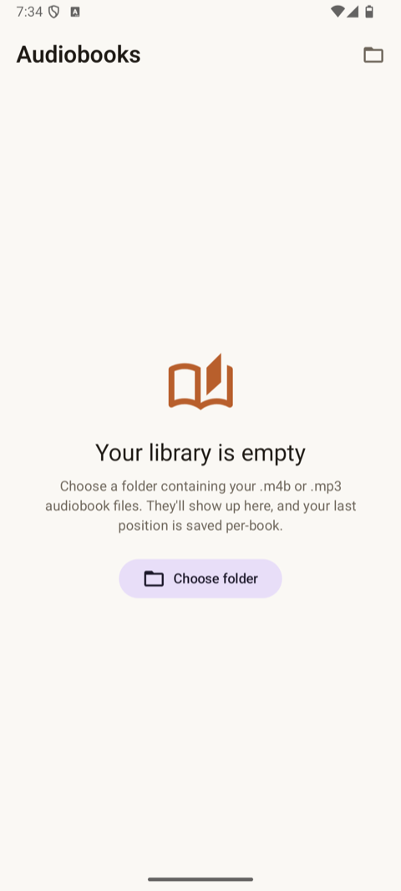
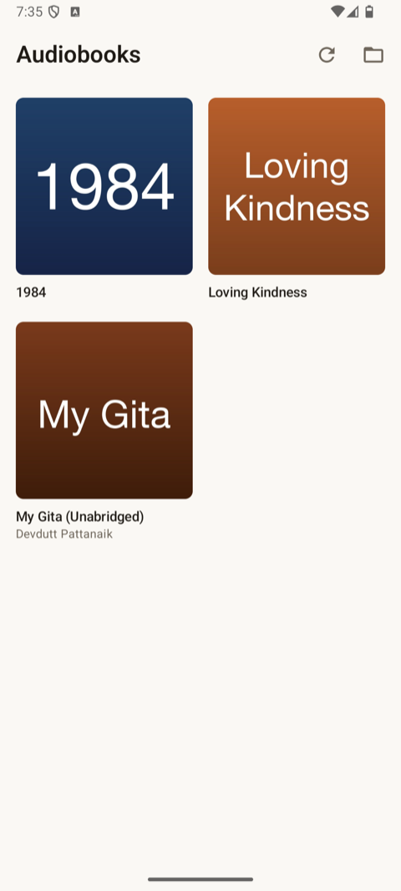
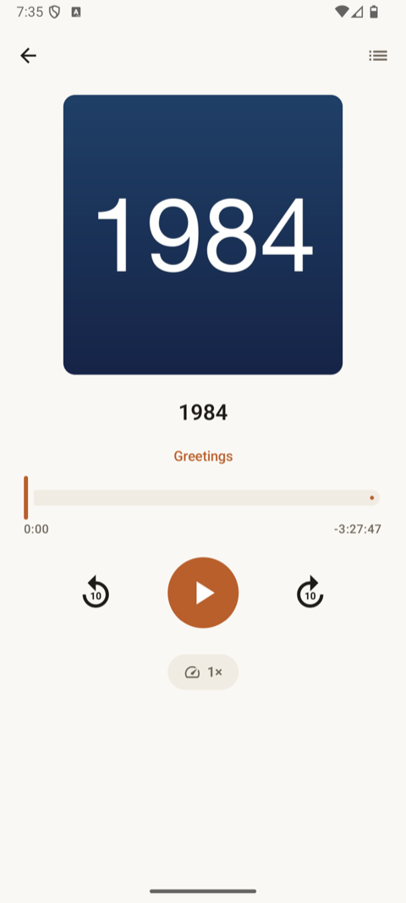
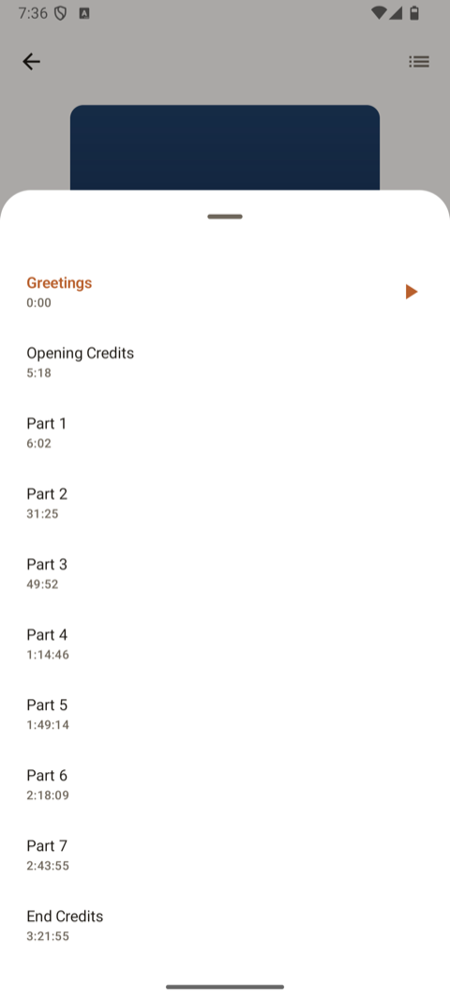

<p align="center">
  
</p>

# Audiobook

A minimal, offline Android audiobook player. Point it at a folder of `.m4b` / `.mp3` files and it builds a clean library with cover art, chapter navigation, position resume, and 1× – 2× playback speed. No accounts, no streaming, no network calls.

Built for people who already have audiobook files locally and want a simple Apple Books-style player without the bloat.

## Features

- **Folder-based library** — pick any folder via Storage Access Framework, the app scans `.m4b`, `.m4a`, and `.mp3` files inside
- **Cover art** — uses the embedded MP4 cover, and falls back to a sidecar `<basename>.jpg` next to the audio file
- **Chapter navigation** — reads MP4 chapter atoms directly (works even on files Android's `MediaExtractor` can't surface), tap any chapter to jump
- **Per-book position resume** — your spot in every book is remembered separately
- **Playback controls** — play/pause, ±10s seek, scrubber, speed cycle (1× → 1.25× → 1.5× → 1.75× → 2×)
- **Material 3 design** — sleek, light/dark aware, edge-to-edge
- **Local only** — no internet permission, no analytics, no account

## Screenshots

<table align="center">
  <tr>
    <td align="center" width="25%"><br/><sub>Empty state</sub></td>
    <td align="center" width="25%"><br/><sub>Library</sub></td>
    <td align="center" width="25%"><br/><sub>Player</sub></td>
    <td align="center" width="25%"><br/><sub>Chapter list</sub></td>
  </tr>
</table>

## How to use

1. Install the APK from [Releases](../../releases) and open it.
2. Tap **Choose folder** and pick the directory containing your `.m4b` / `.mp3` files. The app stores a persistent grant to that folder via Android's Storage Access Framework — you only do this once.
3. The library populates with one card per audio file. Tap a card to open the player.
4. Optional cover art: place a `<basename>.jpg` next to each audio file (same filename as the audio, with `.jpg` instead of `.m4b` / `.mp3`). The app will use it as the cover when the audio file has no embedded artwork.

## Install

Grab `Audiobook-vX.Y.Z.apk` from [Releases](../../releases) and `adb install` it, or sideload via your file manager. **Min SDK 26** (Android 8.0+).

## Build

```bash
JAVA_HOME="/Applications/Android Studio.app/Contents/jbr/Contents/Home" \
  ./gradlew assembleRelease
```

Debug builds: `./gradlew assembleDebug` (output at `app/build/outputs/apk/debug/app-debug.apk`).

## Tech stack

- **UI**: Jetpack Compose with Material 3
- **Architecture**: MVVM, no DI framework
- **Playback**: Media3 / ExoPlayer
- **Storage**: Storage Access Framework + `DocumentFile` for folder access
- **Persistence**: DataStore (Preferences) for the chosen folder URI, per-book position, and playback speed
- **Image loading**: Coil

## How chapter parsing works

The MP4 standard puts chapter markers in a separate "text" track inside the `moov` atom, with a `tref/chap` link from the audio track. Most desktop players read this fine, but **Android's `MediaExtractor` doesn't reliably surface the chapter track** on many devices.

Rather than depend on that, the app walks the MP4 atom tree directly via `Os.pread` over the SAF `ParcelFileDescriptor`:

```
file
├── ftyp / free / mdat / moov   (top-level atoms)
└── moov
    ├── trak (audio)
    │   └── tref / chap   →   chapter track ID
    └── trak (chapter "text" track)
        ├── mdhd          →   timescale
        └── stbl
            ├── stts      →   per-sample timestamps
            ├── stsz      →   per-sample sizes
            ├── stsc      →   sample-to-chunk map
            └── stco/co64 →   chunk file offsets
```

Each chapter sample is `[u16 length][UTF-8 title]`. The parser walks `stts`/`stsz`/`stsc`/`stco` to compute the file offset of each sample, reads it, and produces the chapter list. Plain MP3 files (no chapter track) gracefully return an empty list — playback still works.

## License

MIT
